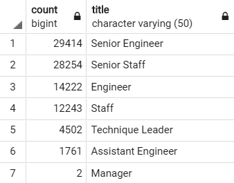
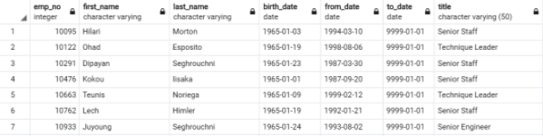

# Pewlett-Hackard-Analysis
This project aimed to help Pewlett Hackard by providing reports to help the management prepare for the "silver tsunami" as many current employees are about to retire. To assist management, we made use of the PH Database by making queries on PostgreSQL to find the information that would help PH. To do the analysis, we generated the following reports:
1. The number of retiring employees per Title
2. The number of employees eligible to participate in a new mentorship program

The information we pulled from this report helped PH determine the number of retiring employees per title, and identify eligible employees to participate in a mentorship program.

To do this, we created a Retirement Titles table that contains all of the titles of current employees born between January 1, 1952 and December 31, 1955. Because some employees may have multiple titles in the database (due to promotions, for example), we used the DISTINCT ON statement to create a table that only contains the most recent title of each employee. Then, using the COUNT() function, we generated a final table containing the number of employees of retirement age by most recent job title.

## Results
### Analysis of Number of Retiring Employees per Title

• From the count column, we can observe that many employees in each of the different title types will be retiring soon.
• From the title column, we can also see that many employees in management-related or senior positions will retire soon, leaving a big gap for leaders in the company.

### Analysis of the number of employees eligible to take part in a new mentorship program

• We can see from this report that there are a lot of employees born in 1965 who are nearing retirement and have management or senior-level positions in their title column.
• The employees who are about to retire from this report may be eligible for mentoring through the company's new mentorship program, designed to develop the next generation of leaders from within the organization.

#### Summary
**How many roles will need to be filled as the "silver tsunami" begins to make an impact?**
By running a query on our unique_titles report and retrieving the number of employees nearing retirement based on their most recent job title, we can see that a total of 90,398 titles need to be filled as the "silver tsunami" takes hold.

**Are there enough qualified, retirement-ready employees in the departments to mentor the next generation of Pewlett Hackard employees?**
By performing the query on our mentorship_eligibility report, which retrieved the number of retiring soon employees born in 1965 who are eligible to serve as mentors in the company's new mentorship program, we can see that a total of 1549 mentors are available. This high number of retiring employees who are eligible to mentor can mentor many current employees to take up management positions in the future, which can help Pewlett Hackard be ready for the "silver tsunami."
