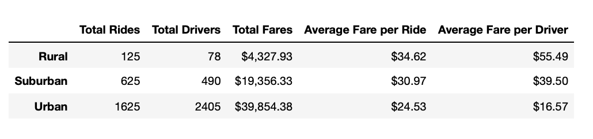
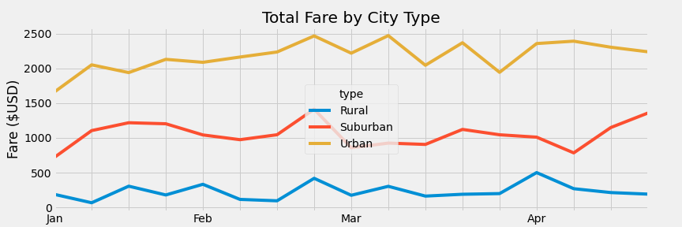

# PyBer_Analysis
## Overview of the analysis
The purpose of this project was to analyze data for a ridesharing company called PyBer in order to calculate metrics related to the company's total weekly fares in each city type. For each of the city types, datasets containing ride and city data were used to calculate metrics such as total rides, total drivers, total fares, and average fare per ride and driver. 

Additionally, the data sets were used to create a new data frame to determine the average weekly fare for each of the city types from January 1st to April 29th 2019. The analysis's dataframe was used to create a multiple-line graph depicting the total weekly fares for each city type over the specified time period. The metrics and visualizations were then analyzed to make recommendations to Pyber's CEO regarding any disparities between city types.

## Results
Leveraging the data we were given, we were able to create a pivot table that gave us a DataFrame that is organized by given index and column values. See the image below:

We can see from this dataframe that urban cities have the most rides and drivers, while rural cities have the fewest. As a result, as indicated by the Total Fares column, urban cities generate the most revenue, while rural cities generate the least.

However, when we examine the Average Fare per Ride column in this dataframe, we see that Rural city types have the highest average fare per ride, implying that this city type will generate more revenue for each additional ride, in comparison to Urban city types, which have the lowest average fare per ride. The average fare per driver is another metric that we can see in this dataframe; from this data, we can see that drivers in rural cities earn $55.49 per ride, while drivers in urban areas earn almost three times as much, or $16.57 per ride.

A multiple line chart was also created as part of the analysis to assist us in visualizing and analyzing the Total Fares for each of the city types from January 1 to April 29th 2019.

We can quickly observe that during the time period analyzed for the total fare for each of the city types, urban city types had the highest total fares for all the weeks, while rural areas had the lowest. Additionally, we can see that the third week of February had the highest total fares for each city type, indicating increased demand during that time period. Urban areas also appear to generate a significant amount of revenue in the first and third weeks of March. Between the beginning of January and the end of April, all fares for each city type are dramatically decreasing.

### Summary
Following our analysis, the following recommendations can be made to more efficiently direct investments in the proper city types:

1. Urban areas have the highest total fare and the greatest number of rides and thus generate most of the company's revenue. As a result, this is the best performing city type, and Pyber should make additional investments in this type to maximize profits for PyBer in the future.

2. Rural cities account for the fewest rides and the fewest fares of all the city types. Still, their average fare per ride is the highest, so increasing just a little ridership in rural areas could significantly increase revenue. In addition, although the rural areas have the fewest drivers, the average fare per driver is the highest; therefore, if ridership can be increased through marketing and other avenues, it may be easier to recruit drivers in the Rural city types.

3. Pyber's suburban city type is a middle performer. Given that there are significantly more rides than drivers, I would suggest that the CEO offer drivers in urban areas a discount for switching to suburban. This may help suburban areas obtain additional rides if they can accommodate at a faster rate.
