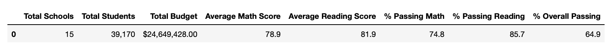
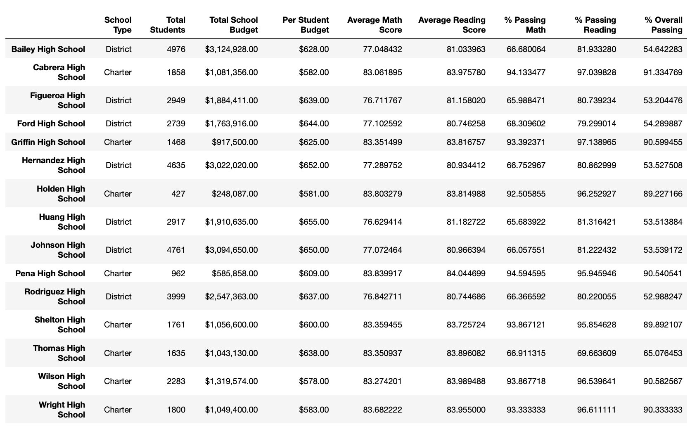

# School District Analysis
The project's goal was to help Maria analyze standardized test data and other school information for a school district to gather insights and trends. We used datasets relating to school funding and standardized test scores to conduct the analysis. 

These data sets were used to demonstrate the performance of schools. Stakeholders will decide about school spending and budgets in the district based on the analysis and key metrics discovered. For example, after a preliminary investigation, it was found that "Thomas High School," one of the schools in the data set, had grades changed for 9th graders. 

As a result, stakeholders demanded that the metrics be recalculated by excluding "Thomas High School's" standardized test scores in math and reading. As a result, the previously calculated metrics have been updated. This report summarizes how excluding data from the school above affected the overall analysis.

## Results
After excluding "Thomas High School" math and reading scores and recalculating our metrics, we discovered the following effects of the changes above in our analysis.

### Affect on the district summary

Following the exclusion of data

We can see from our district summary analysis that excluding the data only resulted in minor changes in the percentage of students passing Math, Reading, and the overall figure. As can be seen, the overall percentage decreased from 65.17 percent to 64.9 percent.

### Affect on School Summary: 

Following the exclusion of data

We can see from our images that excluding the data had a far more significant impact on this data. The percentage of students passing math has dropped from 93.2 percent to 66.9 percent. The same holds true for reading percentages. The overall rate fell from 90.9 percent to 65.07 percent. This indicates that the 9th graders at Thomas High School, in particular, had many students who had previously passed the standardized tests.

Replacing 9th graders' math and reading scores and the effect on Thomas High School's performance relative to the other schools: 

Before replacing the data for 9th graders, Thomas High School was the district's second-best performing school. In addition, after excluding data for 9th graders, Thomas High School was ranked second among the district's 15 schools.

### Affect on Math and Reading Scores by Grade
After removing all of Thomas High School's math and reading scores, there were no values for math and average reading scores by grade.

### Scores by school spending size
Thomas High School was in the $630-644 spending range. The exclusion of 9th-grade scores for Thomas High School had no effect on the overall percentage passing for this spending group.

### Scores by School Size
Thomas High School is a medium-sized school. The exclusion of 9th-grade scores for Thomas High School had no effect on this group's overall percentage passing.

### Scores by School Type
Thomas High School is a charter school. The exclusion of 9th-grade scores for Thomas High School had no effect on this group's overall percentage passing.

## Summary
Excluding Thomas High School's ninth-grade results has made a significant difference in our analysis of the results. We can now conclude that:

• The overall passing rate for Thomas High School dropped significantly in the summary analysis.

• According to district analysis, there are fewer students at Thomas High School than at other schools in the district.

• School type, size, and spending groups did not change over time.

• Overall, the exclusion of this data had a minimal impact on other metrics calculated, apart from skewing the results of the School results analysis.
