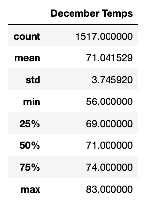
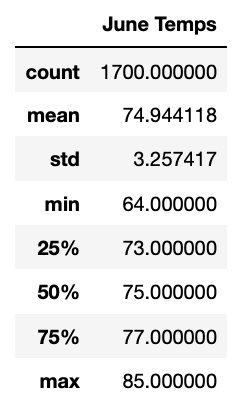

# surfs_up
## Overview of the analysis
W. Avy is looking for Oahu temperature data for the months of June and December in order to determine if the surf and ice cream shop business is year-round sustainable. We performed an analysis using Pandas, Python, and SQLAlchemy to find the proper information and report back to W. Avy.

## Results
• The mean temperatures between June and December remain relatively consistent. 74 in June and 71 in December.
• The maximum temperature is only 2 degrees less in the winter.
• The minimum temperature is about 8 degrees less during the winter.

## Summary
Based on our summary statistics for the months of June and December temperatures in Oahu, we can conclude that the temperature remains warm and consistent throughout the year. The average temperature in June and December is in the 70s, indicating that the weather is warm during the summer and winter months, making it an ideal location for surfing and ice cream all year. 

However, precipitation should be considered when deciding whether Oahu is the best place to open a surf shop because it has an impact on both surfing and ice cream sales. As a result, the following two queries from our available dataset will assist us in retrieving and determining the precipitation or rainfall for June and December, allowing us to make an informed decision:

1.
session.query(Measurement.prcp).filter(extract(‘month’, Measurement.date) ==6).all()

2.
session.query(Measurement.prcp).filter(extract(‘month’, Measurement.date) ==12).all()

After retrieving the precipitation data for both months, we can further analyze this data and analyze our temperature data to determine if Oahu is indeed the ideal location to open the surf shop.
